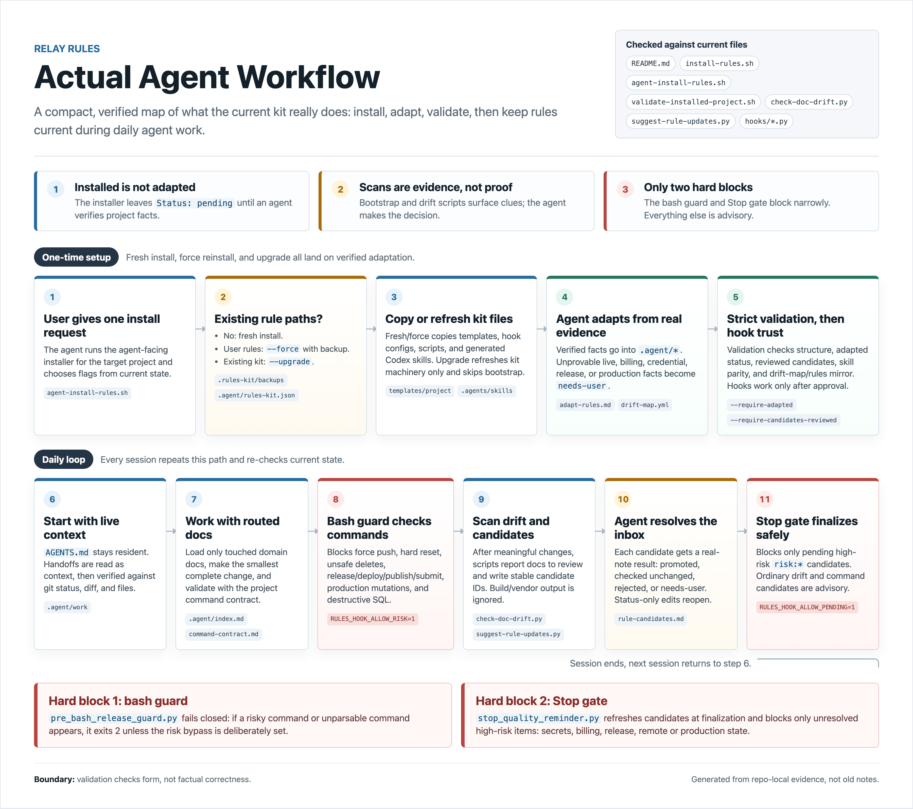

# Relay Rules

English | [简体中文](./README.zh-CN.md)

One set of rules for the AI agents working in your repo (Claude Code / Codex): a new session continues the last one's work instead of starting over, trusts current code over stale docs, and finishes the whole job before stopping.

It's a folder of markdown files plus a few zero-dependency scripts and hooks that you copy into your project. No runtime, no framework. One agent across many sessions is the most common setup; Claude and Codex taking turns works too, and an empty repo is fine.



## Install

**1. Clone this repo anywhere on your machine**

```bash
git clone https://github.com/liyuhao957/relay-rules.git
```

**2. In your project, tell your agent one sentence**

> Install and adapt /path/to/relay-rules for this project.

First install, a project that already has its own rule files, an upgrade from an older version — it's the same sentence either way, no flags for you to figure out: the install script recognizes the situation and says what to do in its output, and the agent takes it from there; any replaced file is backed up to `.rules-kit/backups/` first. Once installed, it reads your real code and fills the templates with this project's verified rules; anything it can't verify (live config, billing, that kind of thing) is marked `needs-user` for you to confirm — guessing is not allowed.

<details>
<summary>What the agent actually does for existing rule files / upgrades</summary>

The agent runs `scripts/agent-install-rules.sh --target <project>`. By default the script refuses to overwrite an existing `AGENTS.md` / `CLAUDE.md` / `.claude/` and names the two ways forward in its error message; the agent picks by what's actually there:

- The rule files are your own, not from this kit → reinstall with `--force`: old files are backed up, then replaced, and read as clues during adaptation.
- The kit was installed before and this is an upgrade → `--upgrade`: only the kit's own pieces are updated — scripts, hooks, skills, workflow docs, the `.agent/index.md` index, and the example configs, each backed up before being replaced; the project facts you filled into the rule docs are untouched. Note the index and workflow docs count as the kit's and get replaced with the new version (your old copies are in the backup — merge edits back if you'd changed them); if validation at the end lists missing new content, the agent merges it once from the template.

</details>

**3. Restart the agent session and approve the project hooks**

Restarting makes the agent reload this setup; the hooks (the guard scripts the kit installed) do nothing until approved — Claude Code asks about project settings (if no prompt appears, check `/hooks`); Codex needs you to trust the project's `.codex/` directory and review the hooks via `/hooks`. Do this after every upgrade too.

That's it. To confirm it's installed and actually adapted:

```bash
/path/to/relay-rules/scripts/validate-installed-project.sh /path/to/project --require-adapted --require-candidates-reviewed
```

## Uninstall

```bash
/path/to/relay-rules/scripts/uninstall-rules.sh --target /path/to/project   # add --dry-run to preview
```

Nothing is deleted: installed files move into a backup, files you had before the install move back into place, backed-up files that carry your content are listed for you to take back, and the remaining `.rules-kit/` is yours to delete once satisfied. If the project is a git repo with a pre-install commit, a git rollback is always the cleanest uninstall; for a broken half-install the script won't recognize, delete the paths in the file map by hand.

## How it works day to day

- **Only `AGENTS.md` (about 35 lines) stays in context.** Every other rule doc loads on demand: touch a domain's files and that domain's doc arrives, nothing else.
- **When code changes, the rules follow.** After any non-trivial change, the agent runs two scan scripts: one lists which docs the diff may have made stale, the other writes "this rule may be stale" candidates into an inbox (`.agent/rule-candidates.md`) for the agent to verify, update, or reject. The scripts only collect evidence; the real decisions stay with the agent.
- **Only two things ever block, both narrow.** Dangerous commands (force push, `rm -rf`, release/deploy), and unhandled high-risk inbox items (secrets, billing, release, remote/production state). Everything else is advisory.
- **Stopping mid-task leaves a handoff note.** Objective, baseline commit, what's verified and what's not — the next session picks up from there.

## Details

<details>
<summary><strong>What gets installed (file map)</strong></summary>

```text
AGENTS.md                     shared agreement; Codex reads it at startup, Claude via @import
CLAUDE.md                     thin Claude entrypoint, imports @AGENTS.md
.agent/
  index.md                    the index: load only what the task needs
  adaptation-review.md        Status: pending | adapted; plus needs-user items
  product-invariants.md       durable product promises
  user-journeys.md            main flows and the loops to close
  command-contract.md         verified commands (+ generated candidates)
  quality-gates.md            the loops that define "done"
  domains/*.md                ui-copy, data-sync, build-test, release, localization, performance
  workflows/*.md              adapt-rules, implement, review, continue, release
  drift-map.yml               changed paths → docs to review; also drives on-demand loading
  rule-candidates.md          the candidate inbox: scripts write, the agent decides
  rule-health.md              when to prune, merge, or delete rules
  project-map.md etc.         bootstrap-scan output (with bootstrap-report.md; clues only)
  handoff-template.md, work/  the handoff note template and where notes live
  decisions/                  durable decisions worth leaving for whoever comes next
  doc-drift.md, *-policy.md   mechanism and policy docs, read on demand
.claude/
  rules/*.md                  path pointers; auto-load on matching file reads
  skills/*/SKILL.md           thin workflow entries (8; the Codex tree is generated from this side)
  agents/*.md                 reviewer / qa / docs-drift-checker subagents
  hooks/*.py + settings.json  bash guard + Stop gate
.agents/skills/*              Codex skill tree — generated at install from .claude/skills
.codex/
  hooks/*.py + hooks.json     bash guard + Stop gate + domain router
scripts/*.py                  bootstrap-project-context, check-doc-drift, suggest-rule-updates
```

Recommended to commit: `AGENTS.md`, `CLAUDE.md`, `.agent/`, `.agents/`, `.claude/`, `.codex/`, `scripts/`, including `.agent/rule-candidates.md` after candidates are handled. Keep `.agent/work/*` (handoff notes) local:

```gitignore
.agent/work/*
!.agent/work/README.md
```

</details>

<details>
<summary><strong>What adaptation fills in</strong></summary>

Right after install, `.agent/adaptation-review.md` says `Status: pending`. Following `.agent/workflows/adapt-rules.md`, the agent reads your real code and turns generic templates into verified facts:

```text
Before (template)            After (agent filled in, verified from real code)
─────────────────            ───────────────────────────────────────────────
product-invariants.md        Free tier is capped at 3 projects.
  <durable promise>          Deleting an account purges synced data within 24h.

user-journeys.md             Sign up → verify email → create first project →
  <main flow>                land on dashboard.

command-contract.md          Test:  npm test       (ran it, passes)
  <verified command>         Build: npm run build  (ran it, succeeds)

drift-map.yml                The "changed paths → docs to review" map,
  <default globs>            tightened to this repo's real paths.
```

Whatever the agent can't prove from code, tests, or tools (live billing state, production config, credentials) never gets written into the rules — it's marked `needs-user` for you to confirm.

Validation checks form, not correctness: whether fields are filled, template placeholders are gone, and every decision carries a real reason. Whether the facts themselves are right is on the agent and on you.

</details>

<details>
<summary><strong>How the inbox resists being brushed off</strong></summary>

A candidate is a to-do note the scripts write for the agent: "this part of the code changed, so some rule may now be stale. Go look, and decide." The agent works through each one and picks one of four outcomes: `promoted` (verified, written into the rules), `checked-unchanged` (looked, nothing to change), `rejected` (not worth being a rule), or `needs-user` (can't verify, left for you).

- **One candidate per rule.** The id is stable (`risk:billing`, `drift:ui-copy`); touching 6 files in one task is still one candidate. A resolved candidate reopens only on genuinely new evidence.
- Committing is not resolving: unhandled high-risk candidates survive the commit.
- Flipping a status without writing a real reason doesn't count; the next scan reverts it.
- Handled items move to an archive at the bottom of the file. History stays readable, and a rejected one won't keep coming back.
- Dependency and build output (`node_modules/`, `dist/`, and the like) never produces candidates, and the installer resolves the ones its own files trigger.
- Only **high-risk** candidates (secrets, billing, release, remote/production state) block finishing; ordinary work doesn't touch a risk area, so you stop as usual.

When the rules themselves start to feel noisy or stale, `.agent/rule-health.md` is the guide for pruning, merging, or deleting. This is meant to stay small.

</details>

<details>
<summary><strong>What actually blocks (and what doesn't)</strong></summary>

| Mechanism | Fires on | Blocks? |
| --- | --- | --- |
| Bash guard (PreToolUse, both tools) | force push; `git reset --hard`; `git clean -fd` (deletes untracked files); `rm -rf` (except rebuildable dirs like `node_modules`, `dist`); release/deploy/publish commands (release, deploy, publish, submit, including wrapped forms like `npx vercel deploy`, `sh -c "npm publish"`); production-targeted mutations through common infra CLIs (kubectl, terraform, supabase, firebase, psql, mysql); destructive SQL through `psql` or `mysql` | **Yes.** Exit 2; bypass with `RULES_HOOK_ALLOW_RISK=1` |
| Stop gate (both tools) | unhandled **high-risk** candidates (`risk:*`: secrets, billing, release, remote/production state); ordinary drift/command candidates are listed but never block | **Yes.** Lists the pending high-risk IDs and the re-check command; a Stop block means "keep going and fix this", not "halt"; bypass with `RULES_HOOK_ALLOW_PENDING=1` |
| Doc-drift report | on demand; also shown when the Stop gate blocks | No. Advisory list of docs to review |
| Drift-map self-check | after adaptation, a directory-anchored glob in the map matches no file in the repo (usually a renamed directory) | No. One-line warning |
| Codex domain router (PostToolUse) | first edit touching a mapped area | No. One-line pointer |
| Everything else — quality loops, source-of-truth order, workflows | the written agreement | No. Agent judgment, by design |

The Stop gate carries an anti-loop switch (`stop_hook_active`), so it can never block forever. The bash guard fails closed: if it can't parse a command, it blocks rather than waving it through, and a crash inside the guard blocks too instead of silently passing the command. "Don't trust stale docs" and "finish the whole job" hold because the agent keeps the agreement — the rules make the right moment easy to catch, but they don't prove correctness.

</details>

<details>
<summary><strong>The token cost</strong></summary>

The fixed cost is two items: the always-loaded `AGENTS.md` (about 35 lines), and one fixed end-of-task check (a thousand or two tokens regardless of task size). Domain docs load only when their files are touched; skills expand only when invoked.

The reliable on-demand entry point is the hand-kept `.agent/index.md` routing map plus `python3 scripts/check-doc-drift.py`, which mechanically lists the docs mapped to your actual diff. Claude's `.claude/rules/` pointers and Codex's after-edit router are a bonus on top; `.claude/rules/` file-scoped auto-loading has known upstream bugs in some Claude Code versions (it loads everything, or never fires), so don't rely on it as the only mechanism.

Matching is word-boundary precise: `ProductCard.tsx` won't trip the production rule just for containing "prod".

</details>

<details>
<summary><strong>The full lifecycle: install → bootstrap scan → adapt → validate → grow</strong></summary>

1. **Install.** `agent-install-rules.sh` copies the templates, generates the Codex skill tree from the canonical Claude one, records metadata in `.agent/rules-kit.json`, backs up any existing rule files, and runs the bootstrap scan. The project is now *installed*, not *adapted*.
2. **Bootstrap scan.** `bootstrap-project-context.py` scans current files and config and writes clues, not conclusions. A file named `sync.ts` is a signal, not proof of verified cloud sync.
3. **Adapt** *(agent-driven).* Following `.agent/workflows/adapt-rules.md`, the agent inspects current code, config, tests, and any old backups, writes only verified facts into `.agent/*`, tightens the drift-map globs to the project's real paths, and mirrors them into `.claude/rules/*`. Unprovable high-risk facts become `needs-user`.
4. **Validate.** `validate-installed-project.sh` checks that the structure exists, that `CLAUDE.md` imports `@AGENTS.md`, that the Codex skill tree matches the canonical one, that scripts are executable, and (with the strict flags) that adaptation status, placeholders, and candidates are all handled. Form, not correctness.
5. **Grow** *(agent-driven).* As code changes, the two scan scripts surface possibly stale docs and new candidates, and the agent verifies, confirms unchanged, rejects, or marks `needs-user`.

</details>

## Friendly Links

- [linux.do](https://linux.do/)
