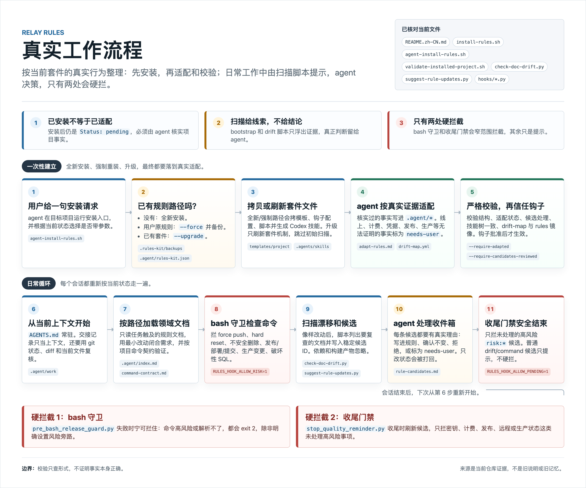

# Relay Rules（接力规则）

[English](./README.md) | 简体中文

给在你项目里干活的 AI agent（Claude Code / Codex）立一套共同规矩：新会话接着上次干，不从零开始；信当前代码，不信过时文档；活做完整才收工。

它就是一组拷进你仓库的 Markdown 文件，加几个零依赖的小脚本和钩子。没有运行时，没有框架。一个 agent 跨会话用是最常见的用法，Claude 和 Codex 换班也行，空仓库也能装。



## 安装

**1. 把本仓库 clone 到机器上任意位置**

```bash
git clone https://github.com/liyuhao957/relay-rules.git
```

**2. 在你的项目里，对 agent 说一句话**

> 为这个项目安装并适配 /path/to/relay-rules

第一次装、项目里已有你自己的规则文件、升级旧版，都是这一句，不用想该带什么参数——安装脚本会识别现状并在输出里说明怎么办，agent 照着处理；被替换的文件一律先备份到 `.rules-kit/backups/`。装好后它读你的真实代码，把模板填成这个项目核实过的规则；查不了的事（线上配置、计费这类）标成 `needs-user` 留给你确认，不许猜。

<details>
<summary>已有规则文件 / 升级旧版时，agent 实际做什么</summary>

agent 跑的是 `scripts/agent-install-rules.sh --target <项目路径>`。脚本默认拒绝覆盖已有的 `AGENTS.md` / `CLAUDE.md` / `.claude/`，并在报错里给出两条路，agent 按现状选：

- 这些规则文件是你自己的、不是本套件装的 → 用 `--force` 重装：旧文件先备份再替换，适配时当线索用。
- 以前装过本套件，这次是升级 → 用 `--upgrade`：只更新套件自带的东西——脚本、钩子、技能、工作流文档、`.agent/index.md` 索引和 example 配置，替换前都先备份；你填进事实文档的项目内容不动。注意索引和工作流文档算套件的、会被换成新版（旧的在备份里，改过的话合并回来）；升级末尾校验若列出缺的新内容，agent 照模板合并一次。

</details>

**3. 重启 agent 会话，批准项目钩子**

重启让 agent 重新加载这套配置；钩子（套件装进项目的拦截脚本）要批准才生效——Claude 会弹窗询问项目设置，没弹就输 `/hooks`；Codex 要信任项目的 `.codex/` 目录，并在 `/hooks` 里把钩子过一遍。升级后这一步也要做。

装完了。想确认没装坏、也真适配过了：

```bash
/path/to/relay-rules/scripts/validate-installed-project.sh /path/to/project --require-adapted --require-candidates-reviewed
```

## 卸载

```bash
/path/to/relay-rules/scripts/uninstall-rules.sh --target /path/to/project   # 加 --dry-run 先预览
```

什么都不删：装进来的文件搬进备份，你装之前就有的文件搬回原位，装着你内容的备份文件逐条列出来等你取回，最后剩下的 `.rules-kit/` 确认后自己删。项目是 git 仓库、装前有提交的话，git 回滚永远是最干净的卸载；装坏了一半、脚本不认时，手动删掉文件地图里列的路径即可。

## 它平时怎么工作

- **常驻上下文的只有约 35 行的 `AGENTS.md`。** 其余规则文档按需加载：改到哪个领域的文件，哪份文档才进来。
- **代码变了，规则跟着变。** 每次像样的改动后，agent 跑两个扫描脚本：一个列出这次 diff 可能弄旧了哪些文档，另一个把「哪条规则可能过时了」的候选写进收件箱（`.agent/rule-candidates.md`），再由 agent 逐条核实、更新或拒绝。脚本只收集证据，实质决定都留给 agent。
- **真正强制拦截的只有两处，都很窄。** 一是危险命令（force push、`rm -rf`、发布部署类），二是收件箱里没处理的高风险事项（密钥、计费、发布、远程/生产状态）。其余一切只提醒、不拦人。
- **中途停下会留交接记录。** 目标、基线 commit、哪些核实了哪些没有，下个会话从这里接着干。

## 细节

<details>
<summary><strong>装进来的是什么（文件地图）</strong></summary>

```text
AGENTS.md                     共享约定；Codex 启动时读，Claude 经 @import 读
CLAUDE.md                     极薄的 Claude 入口，导入 @AGENTS.md
.agent/
  index.md                    索引：只加载任务需要的
  adaptation-review.md        Status: pending | adapted；以及 needs-user 项
  product-invariants.md       持久的产品承诺
  user-journeys.md            主流程与要接通的环节
  command-contract.md         验证过的命令（+ 生成的候选）
  quality-gates.md            定义「做完」的那些环节
  domains/*.md                ui-copy、data-sync、build-test、release、localization、performance
  workflows/*.md              adapt-rules、implement、review、continue、release
  drift-map.yml               改动路径 → 待复查文档；同时驱动按需加载
  rule-candidates.md          候选收件箱：脚本写入，agent 决定
  rule-health.md              何时修剪、合并、删除规则
  project-map.md 等           初始扫描的产出（还有 bootstrap-report.md，都是线索）
  handoff-template.md / work/ 交接记录的模板和存放处
  decisions/                  值得留给后来者的持久决策
  doc-drift.md、*-policy.md   机制与策略说明，按需读
.claude/
  rules/*.md                  路径指针；读到匹配文件时自动加载
  skills/*/SKILL.md           薄工作流入口（8 个，Codex 那份由这边生成）
  agents/*.md                 reviewer / qa / docs-drift-checker 子 agent
  hooks/*.py + settings.json  bash 守卫 + 收尾门禁
.agents/skills/*              Codex 技能树——安装时由 .claude/skills 生成
.codex/
  hooks/*.py + hooks.json     bash 守卫 + 收尾门禁 + 领域路由
scripts/*.py                  bootstrap-project-context、check-doc-drift、suggest-rule-updates
```

建议提交进 git：`AGENTS.md`、`CLAUDE.md`、`.agent/`、`.agents/`、`.claude/`、`.codex/`、`scripts/`，其中也包括候选处理完之后的 `.agent/rule-candidates.md`。只有 `.agent/work/*`（交接记录）保持本地：

```gitignore
.agent/work/*
!.agent/work/README.md
```

</details>

<details>
<summary><strong>适配填的是什么</strong></summary>

刚装完时 `.agent/adaptation-review.md` 写着 `Status: pending`，agent 照 `.agent/workflows/adapt-rules.md` 读你的真实代码，把通用模板变成核实过的事实：

```text
之前（模板）                  之后（agent 照真实代码核实后填入）
─────────────                ───────────────────────────────
product-invariants.md        免费档最多 3 个项目。
  <持久的产品承诺>             删除账号后 24 小时内清除同步数据。

user-journeys.md             注册 → 验证邮箱 → 创建首个项目 → 进入仪表盘。
  <主流程>

command-contract.md          测试：npm test（跑过，通过）
  <验证过的命令>               构建：npm run build（跑过，成功）

drift-map.yml                「改了哪些路径要复查哪些文档」的映射表，
  <默认 glob>                  收紧到这个仓库的真实路径。
```

凡是 agent 没法从代码、测试、工具里证明的（线上计费状态、生产配置、凭据），一律不写进规则，标成 `needs-user` 等你确认。

校验查的是形式，不是正确性：字段填了没有、模板占位符清没清干净、每个决定有没有写真实理由。事实本身对不对，要靠 agent 和你。

</details>

<details>
<summary><strong>收件箱怎么防糊弄</strong></summary>

「候选」是脚本写给 agent 的待办便条：「代码这里变了，某条规则可能跟着过时了，去看一眼，做个决定。」agent 逐条处理，四选一：`promoted`（查实了，写进规则）、`checked-unchanged`（看过了，不用改）、`rejected`（不值得成为规则）、`needs-user`（查不了，留给你确认）。

- **一条规则一个候选。** id 是稳定的（`risk:billing`、`drift:ui-copy`），一次任务改 6 个文件还是一个候选。已解决的候选只在碰到真正的新证据时重新打开。
- 提交不等于解决：没处理的高风险候选不会因为代码提交了就消失。
- 只改状态、不写真实理由，不算数，下次扫描自动打回待办。
- 处理完的挪到文件底部归档区，历史可查，拒过的不会反复纠缠。
- 依赖和构建产物（`node_modules/`、`dist/` 等）永远不产生候选，安装自身触发的候选由安装器直接处理掉。
- 只有**高风险**候选（密钥、计费、发布、远程/生产状态）会拦收尾；普通改动不碰高风险区，照常停。

当规则本身开始啰嗦或过时，`.agent/rule-health.md` 是修剪、合并、删除的指南。这套规则的本意是保持小巧。

</details>

<details>
<summary><strong>哪些真拦、哪些只提醒</strong></summary>

| 机制 | 触发条件 | 拦截？ |
| --- | --- | --- |
| bash 守卫（PreToolUse，两边都有） | force push；`git reset --hard`；`git clean -fd`（删未跟踪文件）；`rm -rf`（`node_modules`、`dist` 这类可随时重建的目录除外）；发布/部署类命令（release、deploy、publish、submit，包括 `npx vercel deploy`、`sh -c "npm publish"` 这类包装写法）；通过常见基础设施 CLI（kubectl、terraform、supabase、firebase、psql、mysql）对生产环境的变更；经 `psql`、`mysql` 执行的破坏性 SQL | **拦。** exit 2；旁路 `RULES_HOOK_ALLOW_RISK=1` |
| 收尾门禁（Stop，两边都有） | 收件箱里还有没处理的**高风险**候选（`risk:*`：密钥、计费、发布、远程/生产状态）；普通的 drift/command 候选只列出、不拦 | **拦。** 列出高风险待办 ID 和复查命令；Stop 拦截的语义是「接着做完」，不是「停机」；旁路 `RULES_HOOK_ALLOW_PENDING=1` |
| 文档漂移报告 | 按需运行；收尾门禁拦截时也一并给出 | 不拦。仅列出待复查文档 |
| 映射表自检 | 适配后，drift-map 里锚定到具体目录的 glob 在仓库中匹配不到文件（通常是目录改名了） | 不拦。一行警告 |
| 领域路由（PostToolUse，仅 Codex） | 首次编辑触及某个映射区域 | 不拦。一行指针 |
| 其余一切——质量闭环、事实优先级、工作流 | 文字约定 | 不拦。靠 agent 判断，设计如此 |

收尾门禁带防循环开关（`stop_hook_active`），不会无限拦下去。bash 守卫拦不准时宁可拦（fail closed）：输入解析不了就拦，不会因为崩溃而静默放行。「别信过时文档」「把活做完整」靠的是 agent 守约定——这套规则让正确的时机容易被抓住，但它不证明正确性。

</details>

<details>
<summary><strong>token 开销</strong></summary>

固定成本只有两项：常驻的 `AGENTS.md`（约 35 行），和收尾时一段固定检查（一两千 token，与任务大小无关）。领域文档碰到对应文件才加载，技能被调用才展开。

按需加载最可靠的入口是手维护的 `.agent/index.md` 路由表，加上 `python3 scripts/check-doc-drift.py` 机械列出「这次 diff 对应哪几份文档」。Claude 的 `.claude/rules/` 路径指针和 Codex 的编辑后路由钩子是在此之上的加成；`.claude/rules/` 的按文件自动加载在部分 Claude Code 版本上有已知上游 bug（要么全局灌、要么不触发），别把它当唯一依靠。

匹配按词边界算：`ProductCard.tsx` 不会因为带着 "prod" 就触发盯生产环境的规则。

</details>

<details>
<summary><strong>完整生命周期：安装 → 初始扫描 → 适配 → 校验 → 生长</strong></summary>

1. **安装。** `agent-install-rules.sh` 拷贝模板，以 Claude 技能树为准生成 Codex 技能树，在 `.agent/rules-kit.json` 记录元数据，备份已有规则文件，并运行初始扫描。此时项目是「已安装」，不是「已适配」。
2. **初始扫描（bootstrap）。** `bootstrap-project-context.py` 扫描当前文件和配置，写下的是线索，不是结论。一个叫 `sync.ts` 的文件是信号，不是「云同步已核实」的证明。
3. **适配**（agent 驱动）。按 `.agent/workflows/adapt-rules.md`，agent 检查当前代码、配置、测试和旧备份，只把核实过的事实写进 `.agent/*`，把 drift-map 的 glob 收紧到项目真实路径，并镜像进 `.claude/rules/*`。无法证明的高风险事实标 `needs-user`。
4. **校验。** `validate-installed-project.sh` 检查结构齐全、`CLAUDE.md` 导入了 `@AGENTS.md`、Codex 技能树与 Claude 那份一致、脚本可执行，以及（带严格参数时）适配状态、占位符和候选都已处理。查形式，不查正确性。
5. **生长**（agent 驱动）。代码变化时，两个扫描脚本浮出可能过时的文档和新的候选，agent 逐条查实、确认未变、拒绝，或标 `needs-user`。

</details>
